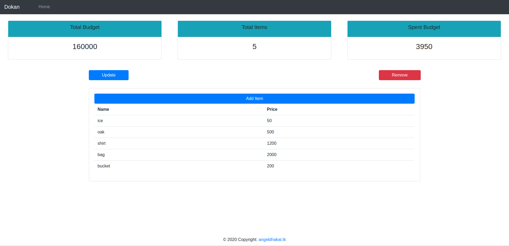

# Project Title

Customer Relation Management



## Getting Started

These instructions will get you a copy of the project up and running on your local machine for development and testing purposes.

### Prerequisites

```
You should have python3.6 or above and Django version 3.0.2 installed in your system.
```

### Installing

After installing python and django follow the steps below

Clone or download the repository in your system

```
git clone https://github.com/AnjalDhakal/customer_relationship_management
```
Go to the folder you have cloned then run the following code in your terminal

```
python manage.py runserver
```

Then go to https://localhost:8000/ in your browser and enjoy


## Built With

* [Django](https://www.djangoproject.com/) - The web framework used
* [Bootstrap](https://getbootstrap.com/) - User Interface
* [Visual Studio Code](https://code.visualstudio.com/) - Text editor Used


## Versioning

We use [git](http://semver.org/) for versioning. For the versions available, see the [tags on this repository](https://github.com/AnjalDhakal/customer_relationship_management). 

## Author

* **Angel Dhakal** - *Initial work* - (https://github.com/AnjalDhakal/customer_relationship_management)

## License

You can only use this product for testing and personal purposes (NOT FOR DEPLOYMENT) 
                        © 2020 Angel dhakal, angeldhakal.tk
